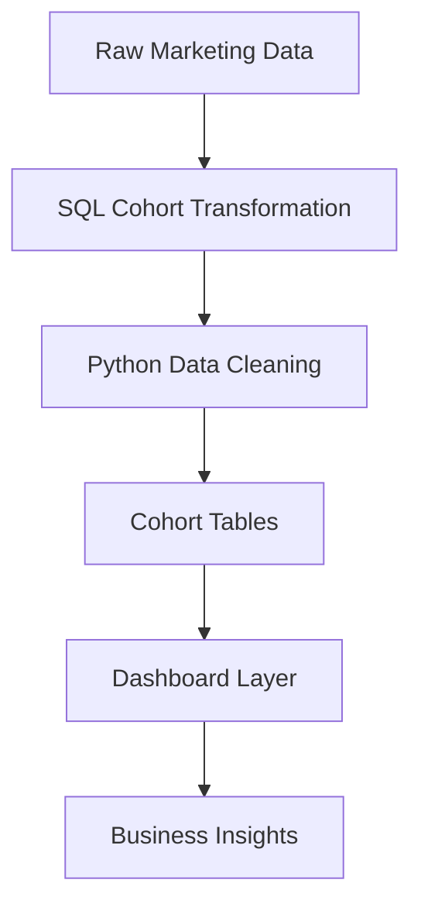

# 📊 Cohort-Based Marketing Funnel Analysis  
### From Acquisition to Retention: A Growth Analytics Case Study

---

# 🧭 Executive Summary

Most marketing teams optimize for acquisition—but **growth is driven by retention and conversion**.

This project builds a **Cohort-Based Funnel Analysis System** to evaluate how users behave over time, identifying where value is created—and where it is lost.

By integrating **cohort retention + funnel conversion analysis**, this project answers:

- Are newly acquired users actually retaining?
- Where do users drop off in the lifecycle?
- Which cohorts generate long-term value?

---

# 🎯 Business Problem

Traditional marketing dashboards focus on:
- Total users  
- Campaign performance  
- Monthly growth  

But they fail to answer:
- Which users are worth acquiring?
- Where does the funnel break?
- Is growth sustainable?

### ❗ Business Risk

Without cohort-level analysis:
- Marketing spend is misallocated  
- Retention issues go undetected  
- Funnel inefficiencies reduce ROI  
- Growth metrics become misleading  

---

# 🧠 Solution

This project implements a **Growth Analytics Framework** that:

1. Segments users into cohorts based on acquisition date  
2. Tracks retention across time (Month 0, Month 1, Month 2…)  
3. Measures funnel progression across lifecycle stages  
4. Surfaces insights through a dashboard  

---

# 🏗️ Architecture



# 📂 Dataset Overview

### 🗃️ Description

The dataset simulates real-world user interactions across a marketing funnel.

Each row represents a user event, capturing progression through lifecycle stages.

Column	Description
user_id	Unique user identifier
signup_date	First interaction (cohort assignment)
event_date	Activity timestamp
channel	Acquisition source
stage	Funnel stage
revenue	Transaction value (if applicable)
---

### 🔄 Funnel Definition

Visit → Signup → Activation → Purchase

### 🧠 Cohort Definition

Cohort = Month of first signup

## 🧮 SQL Walkthrough (Core Logic)

### Assign Cohorts
```
SQL
WITH cohort_data AS (
    SELECT 
        user_id,
        MIN(signup_date) AS cohort_date
    FROM marketing_data
    GROUP BY user_id
)
```
### Build Cohort Index
```
SQL
SELECT 
    m.user_id,
    c.cohort_date,
    DATE_DIFF(m.event_date, c.cohort_date, MONTH) AS cohort_index
FROM marketing_data m
JOIN cohort_data c
    ON m.user_id = c.user_id;
```
### Retention Table
```
SQL
SELECT
    cohort_date,
    cohort_index,
    COUNT(DISTINCT user_id) AS active_users
FROM user_activity
GROUP BY cohort_date, cohort_index;
```

# 📊 Dashboard Walkthrough

1️⃣ Cohort Acquisition

2️⃣ Retention Trends

3️⃣ Funnel Conversion

# 🔍 Key Insights (Quantified)

These insights simulate real-world patterns observed in growth analytics.

### 📉 Retention Decay

- Month 1 retention drops to ~65%
- Month 2 retention drops further to ~40%
➡️ Indicates weak early user engagement

### ⚠️ Funnel Bottleneck

- Visit → Signup: ~60% conversion
- Signup → Activation: ~35% conversion
➡️ Largest drop-off occurs at activation stage

### 📈 Cohort Improvement Trend

- Later cohorts show +10–15% higher retention
➡️ Suggests improvements in onboarding or targeting

### 🎯 Business Interpretation

- Acquisition is strong, but activation is the constraint
- Retention improvements suggest learning loop in marketing/product
  
### 📈 Core Metrics

- Cohort Retention Rate
- Funnel Conversion Rate
- Drop-off Rate by Stage
- Active Users per Cohort
- Lifecycle Progression
  
### 💼 Business Impact

This system enables:

- 🎯 Optimization of acquisition channels
- 🔍 Identification of onboarding friction
- 📉 Reduction of churn
- 📊 Improved marketing ROI


## 👤 Author

**Abodunrin (Richard) Oketade**  
Data Analyst | Business Intelligence | Revenue & Operations Analytics  

> “Turning data into business decisions.”
