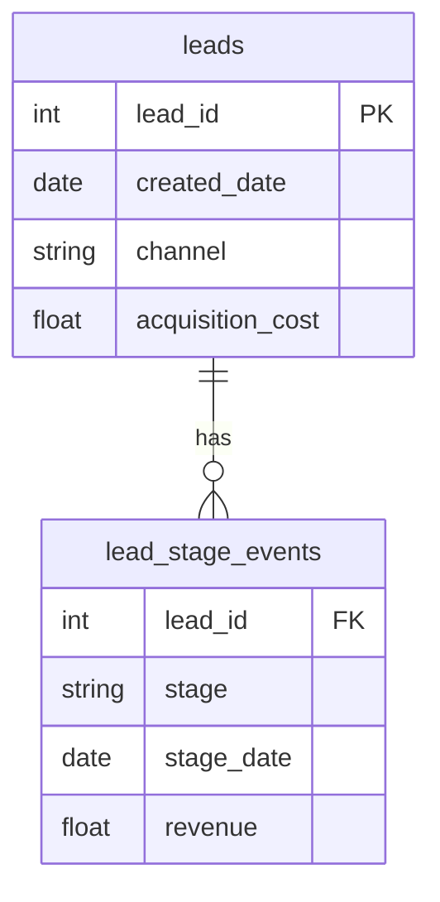
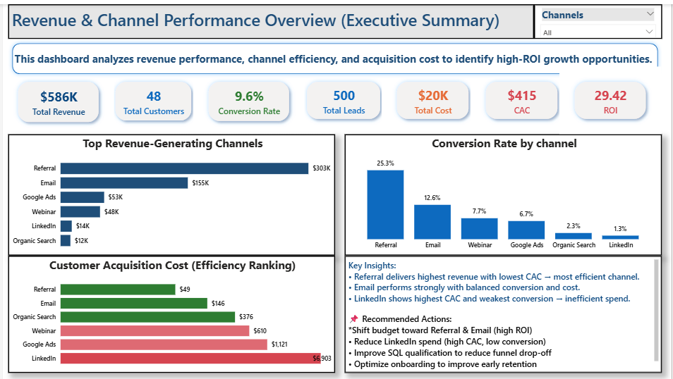
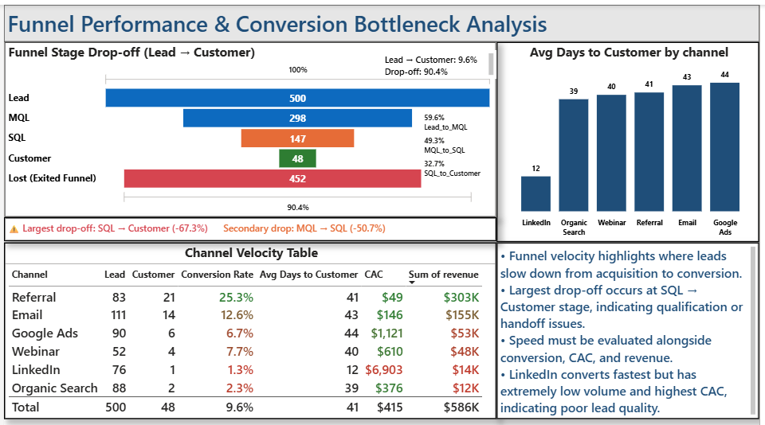
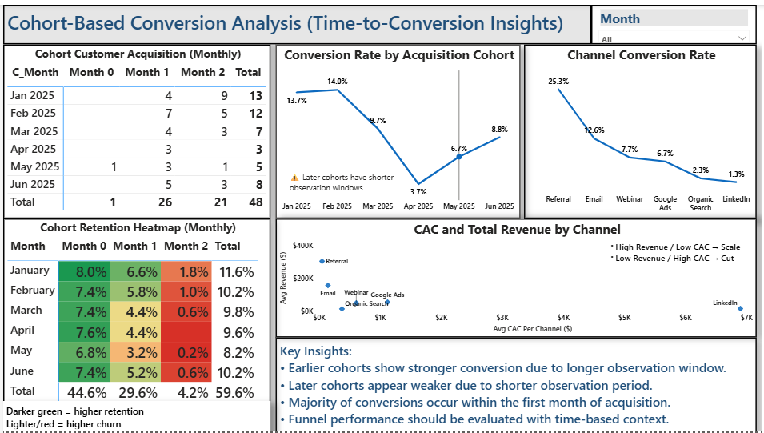

# 📊 Cohort-Based Marketing Funnel Analysis  
**Identifying Conversion Bottlenecks, Retention Decay, and High-ROI Channels**

🚀 End-to-end analytics project combining **SQL, Python, and Power BI** to diagnose where growth breaks across the marketing funnel and how to fix it.

---

## 🔍 What This Project Solves

Most teams track:
- Leads  
- Conversions  
- Revenue  

But still can’t answer:
- **Why users don’t convert**
- **When conversions actually happen**
- **Where the funnel breaks**

👉 This project solves that by integrating:
- **Funnel analysis** → where users drop off  
- **Cohort analysis** → when users convert  
- **Channel analysis** → which sources drive ROI  

---

## 📈 Key Results (Executive Snapshot)

- 🚨 **67% drop-off at SQL → Customer** (primary bottleneck)  
- 📉 **<2% conversion after Month 2** (no delayed conversion)  
- ⚡ **Conversions are front-loaded (0–30 days)**  
- 💸 **LinkedIn = highest CAC, lowest efficiency**  
- 🏆 **Referral & Email = highest ROI channels**

---

## 🧠 Why This Matters

> Growth is not limited by acquisition.  
> It is constrained by **conversion efficiency and timing**.

This analysis shows how to:
- Reduce funnel leakage  
- Improve sales conversion  
- Reallocate marketing spend  
- Focus on the highest-impact growth window  

---

## 📖 Case Study: From Data to Decision

### 🧩 Problem
A marketing team was generating leads but struggling to convert them into customers. The key challenge was identifying whether the issue was:
- Poor acquisition quality  
- Funnel inefficiencies  
- Lack of user engagement over time  

---

### 🔍 Approach
I built a **multi-layered analytics system** combining:

- Funnel analysis → Identify drop-offs  
- Cohort analysis → Understand time-based behavior  
- Channel analysis → Measure ROI and efficiency  

---

### ⚙️ Solution
- Designed a cohort model using SQL (based on `created_date` and `stage_date`)
- Built a funnel conversion framework (Lead → MQL → SQL → Customer)
- Developed an interactive Power BI dashboard to visualize:
  - Conversion bottlenecks  
  - Retention decay  
  - Channel performance  

---

### 📊 Key Findings
- 🚨 Largest drop-off at SQL → Customer (~67%)  
- 📉 Conversions heavily front-loaded (0–30 days)  
- 🔁 No delayed conversion or lifecycle recovery  
- 💸 LinkedIn shows high CAC with low conversion  

---

### 💡 Business Recommendations
- Improve sales closing process and qualification  
- Introduce lifecycle marketing (email, retargeting)  
- Focus on early conversion window  
- Reallocate budget to high-performing channels  

---

### 🎯 Outcome
This analysis transforms raw data into **clear, actionable growth strategy**, enabling stakeholders to:
- Reduce churn  
- Improve conversion  
- Maximize ROI

---

## ❓ Business Questions Answered

- Which acquisition channels generate the highest ROI?
- Where does the largest funnel drop-off occur?
- How quickly do users convert after acquisition?
- Are newer cohorts improving over time?
- Which channels should receive more budget allocation?

---

## 📂 Repository Structure

```text
├── dashboard/
│   ├── cohort_acquisition.png
│   ├── funnel_conversion.png
│   └── retention_analysis.png
├── data/
│   ├── leads.csv
│   └── lead_stage_events.csv
├── sql/
│   └── sql_cohort_analysis.sql
├── Cohort_Funnel_Analytics.pbix
├── cohort_python_starter.py
└── README.md
```

---

## 🗂️ Dataset Structure

### 🧩 `leads` (Acquisition Table)
| Column | Description |
|--------|------------|
| lead_id | Unique lead identifier |
| created_date | Date lead entered funnel (acquisition) |
| channel | Acquisition source |
| acquisition_cost | Cost per lead |

---

### 🧩 `lead_stage_events` (Event Table)
| Column | Description |
|--------|------------|
| lead_id | Foreign key to leads |
| stage | Funnel stage (Lead, MQL, SQL, Customer) |
| stage_date | Date stage was reached |
| revenue | Revenue generated (Customer stage only) |

---

## 📐 Data Model



---

## 🔄 Analytics Workflow

```text
Leads Data
   ↓
SQL Cohort Modeling
   ↓
Python Preprocessing
   ↓
Power BI Semantic Layer
   ↓
Executive Dashboard & Funnel Analytics
```

---

## 🧮 Cohort Analysis Logic (SQL Walkthrough)

### Step 1 — Assign Cohorts (Acquisition Month)

```sql
WITH cohort_data AS (
    SELECT 
        lead_id,
        DATE_TRUNC(created_date, MONTH) AS cohort_date
    FROM leads
)
```

### Step 2 — Map Events to Cohorts
```sql
, user_activity AS (
    SELECT 
        e.lead_id,
        c.cohort_date,
        e.stage,
        e.stage_date,

        DATE_DIFF(e.stage_date, c.cohort_date, MONTH) AS cohort_index

    FROM lead_stage_events e
    JOIN cohort_data c
        ON e.lead_id = c.lead_id
)
```

### Step 3 — Aggregate Active Users
```sql
, cohort_retention AS (
    SELECT
        cohort_date,
        cohort_index,
        COUNT(DISTINCT lead_id) AS active_users
    FROM user_activity
    WHERE cohort_index >= 0
    GROUP BY cohort_date, cohort_index
)
```

### Step 4 — Cohort Size
```
, cohort_size AS (
    SELECT
        cohort_date,
        COUNT(DISTINCT lead_id) AS total_users
    FROM cohort_data
    GROUP BY cohort_date
)
```

### Step 5 — Retention Rate
```sql
SELECT 
    r.cohort_date,
    r.cohort_index,
    r.active_users,
    s.total_users,

    ROUND(r.active_users * 1.0 / s.total_users, 3) AS retention_rate

FROM cohort_retention r
JOIN cohort_size s
    ON r.cohort_date = s.cohort_date

ORDER BY cohort_date, cohort_index;
```

---

## 🎨 Time-to-Conversion Cohort Heatmap — How to Read It

The SQL output is visualized as a **cohort heatmap**:

| Cohort | Month 0 | Month 1 | Month 2 |
|--------|--------|--------|--------|
| Jan    | 🟢     | 🟡     | 🔴     |

---

### 🧩 Structure

- **Rows →** `cohort_date` (acquisition month)  
- **Columns →** `cohort_index` (months since acquisition)  
- **Values →** `retention_rate`  

---

### 🎨 Color Meaning

- 🟢 **Dark Green** → High retention / strong conversion  
- 🟡 **Yellow** → Moderate retention  
- 🔴 **Red** → Low retention / high churn  

---

### 🔍 Interpretation Framework

#### 1. Left → Right (Time Progression)
Shows **retention decay over time**

#### 2. Top → Bottom (Cohort Comparison)
Shows **performance changes across acquisition periods**

#### 3. Diagonal Trends
Indicate whether performance is **improving or declining over time**

---

## 📊 Dashboard Walkthrough

### 1️⃣ Executive Summary
- Revenue, Customers, CAC, ROI  
- Channel performance comparison  

---

### 2️⃣ Funnel Analysis
- Lead → MQL → SQL → Customer  
- Drop-off identification  
- Conversion rates between stages  

---

### 3️⃣ Cohort Analysis
- Conversion over time  
- Retention heatmap  
- Time-to-conversion insights  

---

## 🖼️ Dashboard Preview

### 📊 Executive Summary


### 🔻 Funnel Analysis


### 📈 Cohort Analysis


---

## 🔍 Key Insights (Validated)

### 📉 1. Conversions Are Front-Loaded
- Month 0: ~7–8%  
- Month 1: ~4–6%  
- Month 2: <2%  

👉 Users either convert early or not at all.

---

### 🚨 2. Largest Drop-Off: SQL → Customer (~67%)
Indicates issues in:
- Closing process  
- Lead qualification  
- Offer/pricing  

---

### 🔁 3. No Delayed Conversion Effect
- No recovery after Month 1  
- No retention curve stabilization  

👉 Weak lifecycle marketing / follow-up

---

### 📊 4. Cohort Performance is Flat (Not Improving)
- Month 0 conversion remains stable (~7–8%)  
- No meaningful improvement across cohorts  

👉 Acquisition strategy is **consistent but not optimized**

---

### ⚠️ 5. Time Bias in Recent Cohorts
- Later cohorts appear weaker  
- Due to shorter observation windows  

👉 Must be interpreted with caution

---

## 💼 Business Impact

This system enables:

- 🎯 Identification of conversion bottlenecks  
- 📉 Reduction of funnel drop-off  
- 💰 Optimization of marketing spend  
- 📊 Better allocation across channels  
- 🔁 Integration of acquisition + conversion + retention  

---

## 🚀 Recommendations

### 1. Fix SQL → Customer Conversion
- Improve sales handoff  
- Refine qualification criteria  
- Optimize pricing/offer  

---

### 2. Introduce Lifecycle Marketing
- Email nurture campaigns  
- Retargeting strategies  
- Follow-ups beyond Month 1  

---

### 3. Focus on Early Conversion Window (0–30 days)
- Improve onboarding  
- Strengthen activation triggers  

---

### 4. Reallocate Budget to High-ROI Channels
- Scale Referral & Email  
- Reduce LinkedIn spend  

---

## 📈 Core Metrics

- Cohort Retention Rate  
- Funnel Conversion Rate  
- Drop-off Rate by Stage  
- Customer Acquisition Cost (CAC)  
- ROI (Revenue / Cost)  

---

## 🧰 Tools & Technologies

- SQL → Cohort & funnel modeling  
- Python (Pandas) → Data processing  
- Power BI → Dashboard & visualization  
- GitHub → Version control  

---

## 🧠 Key Learnings

- Cohort analysis reveals **when users convert**, not just how many  
- Funnel analysis identifies **where users drop off**  
- Growth depends on **conversion efficiency, not just acquisition**  
- Combining cohort + funnel provides **full lifecycle visibility**  

---

## 🔁 How to Reproduce

1. Load data from `/data/`  
2. Run SQL queries from `/sql/`  
3. Execute Python preprocessing  
4. Open Power BI dashboard and refresh  

---

## 🧾 Final Takeaway

> Growth is not about acquiring more users.  
> It’s about **converting users efficiently and early in the lifecycle**.


## 👤 Author

**Abodunrin (Richard) Oketade**  
Data Analyst | Business Intelligence | Revenue & Operations Analytics  

> “Turning data into business decisions.”
