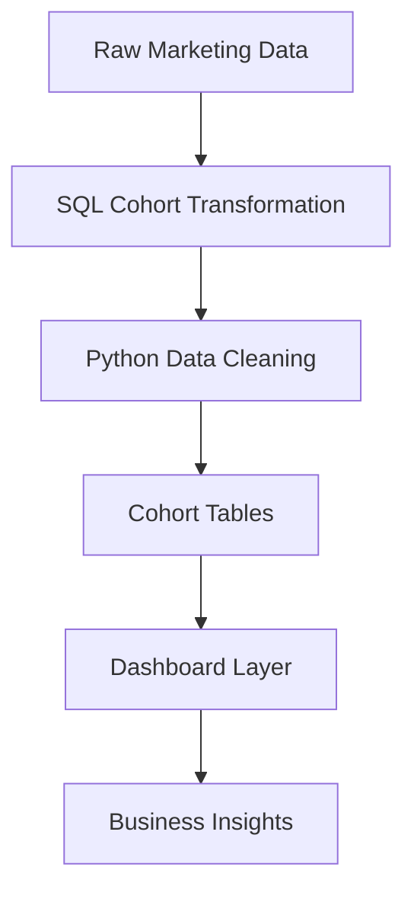

# 📊 Cohort-Based Marketing Funnel Analysis  
### From Acquisition to Retention: A Growth Analytics Case Study

---

# 🧭 Executive Summary

Most marketing teams optimize for acquisition—but **growth is driven by retention and conversion**.

This project builds a **Cohort-Based Funnel Analysis System** to evaluate how users behave over time, identifying where value is created—and where it is lost.

By integrating **cohort retention + funnel conversion analysis**, this project answers:

- Are newly acquired users actually retaining?
- Where do users drop off in the lifecycle?
- Which cohorts generate long-term value?

---

## 🎯 Business Problem

Traditional marketing dashboards focus on:
- Total users  
- Campaign performance  
- Monthly growth  

But they fail to answer:
- Which users are worth acquiring?
- Where does the funnel break?
- Is growth sustainable?

### ❗ Business Risk

Without cohort-level analysis:
- Marketing spend is misallocated  
- Retention issues go undetected  
- Funnel inefficiencies reduce ROI  
- Growth metrics become misleading  

---

## 🧠 Solution

This project implements a **Growth Analytics Framework** that:

1. Segments users into cohorts based on acquisition date  
2. Tracks retention across time (Month 0, Month 1, Month 2…)  
3. Measures funnel progression across lifecycle stages  
4. Surfaces insights through a dashboard  

---

## 🏗️ Architecture



## 📂 Dataset Overview

### 🗃️ Description

The dataset simulates real-world user interactions across a marketing funnel.

Each row represents a user event, capturing progression through lifecycle stages.

### 🔄 Funnel Definition

Visit → Signup → Activation → Purchase

### 🧠 Cohort Definition

Cohort = Month of first signup

## 🧮 SQL Walkthrough (Core Logic)

### Assign Cohorts
```
SQL
WITH cohort_data AS (
    SELECT 
        user_id,
        MIN(signup_date) AS cohort_date
    FROM marketing_data
    GROUP BY user_id
)
```
### Build Cohort Index
```
SQL
SELECT 
    m.user_id,
    c.cohort_date,
    DATE_DIFF(m.event_date, c.cohort_date, MONTH) AS cohort_index
FROM marketing_data m
JOIN cohort_data c
    ON m.user_id = c.user_id;
```
### Retention Table
```
SQL
SELECT
    cohort_date,
    cohort_index,
    COUNT(DISTINCT user_id) AS active_users
FROM user_activity
GROUP BY cohort_date, cohort_index;
```

## 📊 Dashboard Walkthrough

### 1️⃣ Cohort Acquisition
- Tracks user acquisition trends across time  
- Compares cohort sizes and initial engagement


### 2️⃣ Retention Trends
- Visualizes retention decay across cohorts  
- Identifies churn patterns and engagement drop-off


### 3️⃣ Funnel Conversion
- Measures user progression across lifecycle stages  
- Highlights key conversion bottlenecks


---

## ⚡ Key Insights (Executive Summary)

- 📉 **Retention drops to ~65% (Month 1) and ~40% (Month 2)**  
- ⚠️ **Major funnel drop-off at Signup → Activation (~35%)**  
- 📈 **Later cohorts show +10–15% retention improvement**  
- 🎯 **Activation—not acquisition—is the primary growth constraint**

---

## 🔍 Insight Breakdown

### 📉 Retention Decay
- Month 1: ~65% retention  
- Month 2: ~40% retention  
➡️ Indicates weak early engagement and onboarding gaps  

---

### ⚠️ Funnel Bottleneck
- Visit → Signup: ~60% conversion  
- Signup → Activation: ~35% conversion  
➡️ Largest drop-off occurs at activation stage  

---

### 📈 Cohort Improvement Trend
- Later cohorts show +10–15% higher retention  
➡️ Suggests improvements in targeting or onboarding  

---

### 🎯 Business Interpretation
- Strong acquisition performance, but weak activation  
- Retention improvements indicate iterative optimization  
- Growth is constrained by mid-funnel inefficiencies  

---

## 📈 Core Metrics

- Cohort Retention Rate  
- Funnel Conversion Rate  
- Drop-off Rate by Stage  
- Active Users per Cohort  
- Lifecycle Progression  

---

## 💼 Business Impact

- 🎯 Optimize acquisition toward high-retention cohorts  
- 🔍 Identify and fix onboarding friction  
- 📉 Reduce churn through early engagement improvements  
- 📊 Improve overall marketing ROI  

---

## 🔁 Reproducibility

### 1. Data Preparation
- Load dataset from `/data/`  
- Validate date formats  

### 2. SQL Analysis
- Run `/sql/cohort_analysis.sql`  
- Generate cohort tables  

### 3. Python Processing
```bash
python python/data_preprocessing.py
```

## 👤 Author

**Abodunrin (Richard) Oketade**  
Data Analyst | Business Intelligence | Revenue & Operations Analytics  

> “Turning data into business decisions.”
