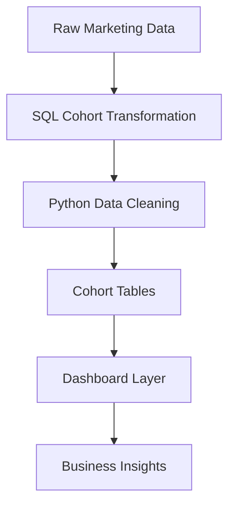

# 📊 Cohort-Based Marketing Funnel Analysis  
### From Acquisition to Retention: A Growth Analytics Case Study

---

# 🧭 Executive Summary

Most marketing teams optimize for acquisition—but **growth is driven by retention and conversion**.

This project builds a **Cohort-Based Funnel Analysis System** to evaluate how users behave over time, identifying where value is created—and where it is lost.

By integrating **cohort retention + funnel conversion analysis**, this project answers:

- Are newly acquired users actually retaining?
- Where do users drop off in the lifecycle?
- Which cohorts generate long-term value?

---

# 🎯 Business Problem

Traditional marketing dashboards focus on:
- Total users  
- Campaign performance  
- Monthly growth  

But they fail to answer:
- Which users are worth acquiring?
- Where does the funnel break?
- Is growth sustainable?

### ❗ Business Risk

Without cohort-level analysis:
- Marketing spend is misallocated  
- Retention issues go undetected  
- Funnel inefficiencies reduce ROI  
- Growth metrics become misleading  

---

# 🧠 Solution

This project implements a **Growth Analytics Framework** that:

1. Segments users into cohorts based on acquisition date  
2. Tracks retention across time (Month 0, Month 1, Month 2…)  
3. Measures funnel progression across lifecycle stages  
4. Surfaces insights through a dashboard  

---

# 🏗️ Architecture

## 🛠️ Tools & Technologies

- **SQL (BigQuery)** → Data extraction & transformation  
- **Python (Pandas)** → Data cleaning & cohort structuring  
- **Power BI** → Visualization & storytelling  

---

## 📊 Analytical Approach

### Step 1 — Data Preparation
- Cleaned and structured funnel dataset  
- Validated conversion stages (Lead → MQL → SQL → Customer)  

### Step 2 — Cohort Structuring
- Grouped leads by acquisition month  
- Created time-based conversion tracking  

### Step 3 — Analysis
- Measured conversion rates per cohort over time  
- Compared early vs late cohort performance  

---

## 📈 Key Insights

### 1. Time Drives Conversion Performance
- Earlier cohorts showed higher conversion rates  
- Not due to better performance, but **longer time to convert**

---

### 2. Majority of Conversions Happen Early
- Most conversions occurred within the **first 30 days**  
- Conversion probability drops significantly afterward  

---

### 3. Recent Cohorts Are Misleading
- Lower conversion rates were observed  
- Root cause: **insufficient observation window**, not poor performance  

---

## 📉 Business Impact

Without cohort analysis:
- Teams may **shift budget away from recent campaigns prematurely**
- Underestimate **conversion timelines**
- Misalign **performance expectations**

With cohort analysis:
- ✅ Better forecasting of conversions  
- ✅ Improved campaign evaluation  
- ✅ Smarter budget allocation  

---

## 🔍 Before vs After

| Approach | Insight Quality | Risk |
|----------|---------------|------|
| Snapshot Analysis | Low | Misleading conclusions |
| Cohort Analysis | High | Accurate decision-making |

---

## 💡 Key Takeaways

- **Time is a critical variable in funnel analysis**  
- Snapshot ≠ Cohort analysis  
- Data interpretation matters as much as data itself  

> 👉 *Good analysis is not just about data — it's about context.*

---

## 📊 Dashboard Highlights

- Cohort conversion trends  
- Time-to-conversion analysis  
- Funnel performance comparison across cohorts  

---

## 🧩 Limitations

- Dataset size and structure may limit generalization  
- Assumes consistent tracking across funnel stages  
- No external factors (seasonality, campaigns) included  

---

## 🔮 Future Improvements

- Integrate **channel-level cohort analysis**  
- Add **predictive modeling for conversion forecasting**  
- Include **time-to-event survival analysis**  

---

## 📚 Key Learnings

- Importance of choosing the right analytical framework  
- Difference between descriptive vs temporal analysis  
- How to translate technical findings into business insights  

---

## 🔗 Project Links

- 📂 GitHub Repository: [ link here](https://github.com/Richie-Rokka/Cohort-Based-Marketing-Funnel-Analysis-SQL-Python-Power-BI)
- 📊 Dashboard Preview: *(Add Power BI screenshot or link)*  

---

## 👤 Author

**Abodunrin (Richard) Oketade**  
Data Analyst | Business Intelligence | Revenue & Operations Analytics  

> “Turning data into business decisions.”
