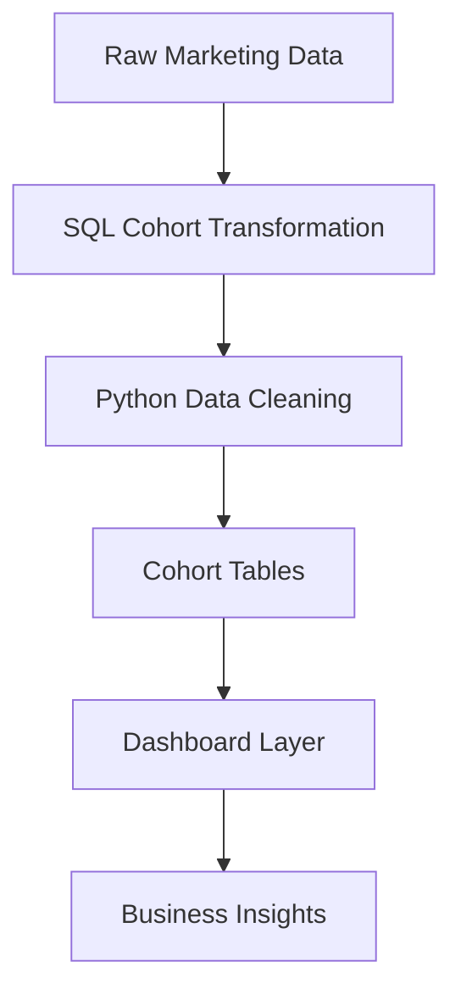
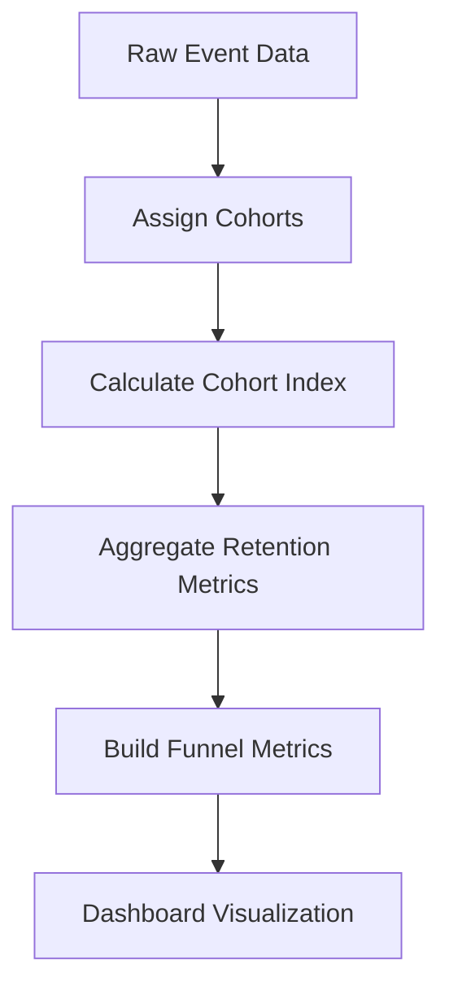

# 📊 Cohort-Based Marketing Funnel Analysis  
### From Acquisition to Retention: A Growth Analytics Case Study

---
## 📊 Dashboard Preview


# 🧭 Executive Summary

Most marketing teams optimize for acquisition—but **growth is driven by retention and conversion**.

This project builds a **Cohort-Based Funnel Analysis System** to evaluate how users behave over time, identifying where value is created—and where it is lost.

By integrating **cohort retention + funnel conversion analysis**, this project answers:

- Are newly acquired users actually retaining?
- Where do users drop off in the lifecycle?
- Which cohorts generate long-term value?

---

## 🎯 Business Problem

Traditional marketing dashboards focus on:
- Total users  
- Campaign performance  
- Monthly growth  

But they fail to answer:
- Which users are worth acquiring?
- Where does the funnel break?
- Is growth sustainable?

### ❗ Business Risk

Without cohort-level analysis:
- Marketing spend is misallocated  
- Retention issues go undetected  
- Funnel inefficiencies reduce ROI  
- Growth metrics become misleading  

---

## 🧠 Solution

This project implements a **Growth Analytics Framework** that:

1. Segments users into cohorts based on acquisition date  
2. Tracks retention across time (Month 0, Month 1, Month 2…)  
3. Measures funnel progression across lifecycle stages  
4. Surfaces insights through a dashboard  

---

## 🏗️ Architecture


---

# 📂 Dataset & Data Structure

## 🗃️ Data Overview

The dataset simulates **user-level event data across a marketing funnel**, capturing how users progress from acquisition to conversion.

Each row represents a **single user event**, not a user summary.

---

## 🧱 Data Grain

> **Grain:** One row per *user per event per date*

This means:
- A single user can appear multiple times
- Each row reflects a stage interaction (e.g., Visit, Signup)

---

## 📊 Sample Data

| user_id | signup_date | event_date | stage      | channel  | revenue |
|--------|------------|------------|------------|----------|---------|
| 1001   | 2023-01-05 | 2023-01-05 | Visit      | Organic  | 0       |
| 1001   | 2023-01-05 | 2023-01-06 | Signup     | Organic  | 0       |
| 1001   | 2023-01-05 | 2023-01-08 | Activation | Organic  | 0       |
| 1001   | 2023-01-05 | 2023-01-10 | Purchase   | Organic  | 120     |

---

## 🔄 Funnel Logic

```text
Visit → Signup → Activation → Purchase
```
Users progress through stages, but:
- Not all users complete the funnel
- Drop-offs occur at each stage

---
## 🧠 Cohort Definition
> Cohort = Month of first signup

Example:
- User signs up Jan 2023 → belongs to Jan cohort
- All future activity is tracked relative to this cohort

---

## 🧮 Derived Fields (Created During Analysis)

| Field            | Description                                              |
|------------------|----------------------------------------------------------|
| `cohort_date`    | Month of user’s first signup (cohort assignment)          |
| `cohort_index`   | Number of months since signup (0 = acquisition period)    |
| `active_flag`    | Binary indicator of user activity within a given period   |
| `conversion_flag`| Binary indicator of funnel stage completion               |

---

## 🔁 Data Transformation Flow

```
sql
-- Cohort Index Calculation
DATE_DIFF(event_date, cohort_date, MONTH) AS cohort_index
```
---
## ⚙️ Why This Structure Matters

This data model enables:
- Cohort retention tracking over time
- Funnel conversion analysis by stage
- Cross-cohort performance comparison
- Identification of lifecycle bottlenecks

---

## ⚠️ Assumptions
- Users follow a linear funnel progression
- signup_date represents first meaningful interaction
- Missing stages indicate drop-off

---

### 🧮 Cohort Analysis SQL Walkthrough

```sql
-- =========================================
-- Cohort-Based Retention Analysis Pipeline
-- =========================================

WITH cohort_data AS (
    -- Step 1: Assign each user to a cohort (first signup date)
    SELECT 
        user_id,
        MIN(signup_date) AS cohort_date
    FROM marketing_data
    GROUP BY user_id
),

user_activity AS (
    -- Step 2: Map user activity to cohort and calculate time offset
    SELECT 
        m.user_id,
        c.cohort_date,
        m.event_date,

        -- cohort_index = months since signup (0 = acquisition month)
        DATE_DIFF(m.event_date, c.cohort_date, MONTH) AS cohort_index
    FROM marketing_data m
    JOIN cohort_data c
        ON m.user_id = c.user_id
),

cohort_retention AS (
    -- Step 3: Aggregate active users by cohort and period
    SELECT
        cohort_date,
        cohort_index,
        COUNT(DISTINCT user_id) AS active_users
    FROM user_activity
    WHERE cohort_index >= 0
    GROUP BY cohort_date, cohort_index
),

cohort_size AS (
    -- Step 4: Calculate total users in each cohort
    SELECT
        cohort_date,
        COUNT(DISTINCT user_id) AS total_users
    FROM cohort_data
    GROUP BY cohort_date
)

-- Step 5: Final output with retention rate
SELECT 
    r.cohort_date,
    r.cohort_index,
    r.active_users,
    s.total_users,

    -- Retention rate = active users / total cohort size
    ROUND(r.active_users * 1.0 / s.total_users, 2) AS retention_rate

FROM cohort_retention r
JOIN cohort_size s
    ON r.cohort_date = s.cohort_date

ORDER BY r.cohort_date, r.cohort_index;
```

## 🎨 Cohort Heatmap (How to Read the Output)

The final SQL output can be visualized as a **cohort heatmap**, where each row represents a cohort and each column represents time since acquisition.

### 📊 Structure

| Cohort (Signup Month) | Month 0 | Month 1 | Month 2 | Month 3 |
|------------------------|--------|--------|--------|--------|
| Jan 2023              | 100%   | 65%    | 42%    | 30%    |
| Feb 2023              | 100%   | 70%    | 50%    | 38%    |
| Mar 2023              | 100%   | 75%    | 55%    | —      |

- **Rows (Y-axis)** → `cohort_date` (grouped by signup month)  
- **Columns (X-axis)** → `cohort_index` (months since signup)  
- **Cell values** → `retention_rate`  

---

### 🎯 What the Colors Represent

In a heatmap:
- 🟢 **Darker/stronger color** → Higher retention  
- 🔴 **Lighter/weaker color** → Lower retention  

This allows you to quickly identify:
- High-performing cohorts  
- Retention decay patterns  
- Improvements across time  

---

### 🔍 How to Interpret

#### 1. Retention Decay (Left → Right)
- Each row shows how a cohort retains over time  
- A steep drop indicates **poor early engagement**

👉 Example:  
Jan cohort drops from **100% → 42% by Month 2** → weak retention

---

#### 2. Cohort Comparison (Top → Bottom)
- Compare rows to evaluate performance across cohorts  

👉 Example:  
Feb cohort retains **50% at Month 2 vs Jan’s 42%**  
➡️ Indicates improvement in onboarding or acquisition quality  

---

#### 3. Diagonal Trends (Growth Signal)
- Look diagonally to track performance improvements over time  

👉 If later cohorts consistently retain better:  
➡️ Suggests **product or marketing optimization is working**

---

### ⚠️ Key Patterns to Watch

- **Sharp early drop (Month 0 → 1)** → Onboarding friction  
- **Flat retention curve** → Strong product engagement  
- **Improving cohorts over time** → Learning loop in growth strategy  
- **Declining cohorts** → Potential product or channel issues  

---

### 💡 Business Insight Translation

The heatmap helps answer:

- Are we acquiring **high-quality users**?  
- Where does **churn happen in the lifecycle**?  
- Are changes in marketing or product **improving retention**?  

---

### 🧠 How This Connects to Your SQL

- `cohort_date` → Rows  
- `cohort_index` → Columns  
- `retention_rate` → Heatmap values  

👉 Your SQL output is directly **pivoted into this visual format** in the dashboard.

---

## 📊 Dashboard Walkthrough

### 1️⃣ Cohort Acquisition
- Tracks user acquisition trends across time  
- Compares cohort sizes and initial engagement


### 2️⃣ Retention Trends
- Visualizes retention decay across cohorts  
- Identifies churn patterns and engagement drop-off


### 3️⃣ Funnel Conversion
- Measures user progression across lifecycle stages  
- Highlights key conversion bottlenecks


---

## 🔍 Key Insights (Cohort + Funnel Synthesis)

This analysis combines **funnel conversion** and **cohort behavior** to diagnose where growth is constrained and how users progress over time.

---

### 1) Front-Loaded Conversion (0–30 Days Window)
- Month 0 conversion is consistently **~7–8%** across cohorts.
- Month 1 drops to **~4–6%**, and by Month 2 falls below **2%**.

**Interpretation:**  
Most users either convert **immediately** or **not at all**. The system is **front-loaded**, with limited delayed conversion.

---

### 2) Severe Late-Stage Leakage (SQL → Customer)
- Funnel analysis shows the largest drop at **SQL → Customer (~67% loss)**.
- Cohort data confirms that **post–Month 1 recovery is minimal**.

**Interpretation:**  
Users who reach late stages are **not being effectively closed**. This points to issues in:
- sales handoff / qualification  
- pricing or offer friction  
- closing effectiveness  

---

### 3) No Retention Curve Stabilization
Typical healthy funnels show: `High → Drop → Stabilize`  
Observed pattern: `High → Drop → Collapse`

**Interpretation:**  
There is **no long-term engagement or nurture effect**. Once users fail to convert early, they rarely convert later.

---

### 4) Cohort Performance: Slight Downward Trend (with Time Bias)
- Early cohorts (Jan–Feb) total conversion: **~10–11%**
- Later cohorts (Apr–May): **~8–9%**

⚠️ Note: Later cohorts have **shorter observation windows**, partially understating performance.

**Interpretation:**  
After adjusting for time bias, results suggest:
- **stable but not improving** acquisition quality  
- no meaningful gains in onboarding or targeting  

---

### 5) Stable Entry Conversion, Limited Optimization
- Month 0 remains **flat (~7–8%)** across cohorts

**Interpretation:**  
Top-of-funnel is **consistent**, but **not improving**—indicating limited iteration in:
- targeting  
- messaging  
- onboarding  

---

## 🎯 Business Implications

- Growth is **not constrained by acquisition volume**
- It is constrained by:
  1. **Late-stage conversion (SQL → Customer)**
  2. **Lack of lifecycle/nurture beyond Month 1**
  3. **Static acquisition quality**

---

## 🚀 Recommended Actions

**1. Fix SQL → Customer Conversion**
- Audit sales handoff and qualification criteria  
- Test pricing/offer positioning  
- Improve closing workflows  

**2. Introduce Lifecycle Marketing**
- Email nurture sequences (30–60 day window)  
- Retargeting for non-converted SQLs  
- Structured follow-up cadence  

**3. Optimize for Early Conversion Window**
- Focus budget and messaging on **first 30 days**  
- Improve onboarding and activation triggers  

**4. Rebalance Channel Mix**
- Scale **Referral & Email** (high ROI)  
- Reduce **LinkedIn** (high CAC, low conversion)  

---

## 🔁 Reproducibility

### 1. Data Preparation
- Load dataset from `/data/`  
- Validate date formats  

### 2. SQL Analysis
- Run `/sql/cohort_analysis.sql`  
- Generate cohort tables  

### 3. Python Processing
```
bash
python python/data_preprocessing.py
```
### 4. Dashboard
- Open /dashboard/cohort_dashboard.pbix
- Refresh data model

---

## 🧰 Tools & Technologies
- SQL → Cohort modeling
- Python (Pandas) → Data cleaning
- Power BI → Visualization
- GitHub → Version control

---

## 🧠 Key Learnings
- Cohort analysis reveals **hidden retention dynamics**
- Funnel analysis identifies **conversion bottlenecks**
- Growth requires integrating **acquisition + retention + conversion**
- Structuring projects like systems improves **analytical clarity**

---
## 🚀 Future Improvements
- Add Customer Lifetime Value (LTV)
- Build churn prediction model
- Automate ETL pipeline
- Deploy dashboard online

---

## 🧠 Final Takeaway

> Growth is not about acquiring more users.  
> It’s about **converting users within the critical early window** and **removing friction at the point of purchase**.

---

## 👤 Author

**Abodunrin (Richard) Oketade**  
Data Analyst | Business Intelligence | Revenue & Operations Analytics  

> “Turning data into business decisions.”
